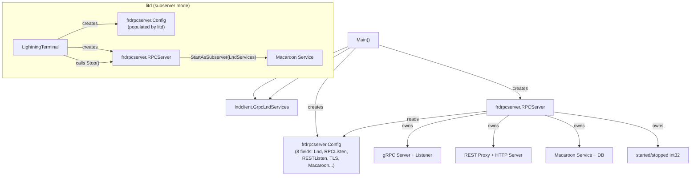
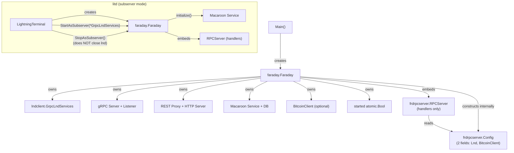

# Faraday Architecture: Before & After

## Before: RPCServer owns everything

## After: Faraday owns lifecycle, RPCServer is just handlers

## Key Changes

| Concern | Before | After |
|---------|--------|-------|
| Lifecycle owner | `frdrpcserver.RPCServer` | `faraday.Faraday` |
| Config scope | `frdrpcserver.Config` (8 fields) | `faraday.Config` (full) + `frdrpcserver.Config` (2 fields) |
| lnd connection | Created/closed by `Main()` | Owned by `Faraday` (standalone) or borrowed (subserver) |
| Bitcoin client | Created by caller, passed in Config | Created inside `Faraday.initialize()` |
| Macaroon setup | Inside `RPCServer.Start()` | Inside `Faraday.initialize()` |
| RPCServer role | Lifecycle + handlers + auth | Handlers only |
| Start guard | `started`/`stopped` int32 (no restart, no reset) | `started` atomic.Bool (resets on stop and failure) |
| Stop pairing | `Stop()` for both modes | `Stop()` = standalone, `StopAsSubserver()` = shared lnd |
